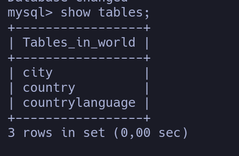

# Ejercicio Sobre Conceptos Basicos de SQL

## Pregunta 1

Agregue más datos a la base de datos. Cree una nueva tabla llamada actor con una relación de varios a varios con la tabla de película. Recuerde que para esto es necesario crear una tabla intermedia que permita dividir la relación de varios a varios en dos relaciones de uno a varios. Agregue las restricciones necesarias. Realice varias consultas SQL, explique sus consultas y peque aquí la consulta y los resultados (Por lo menos tres consultas distintas).

### Desarrollo

Dentro de la base de datos creada a partir de seguir la guía se genera una tabla correspondientes al objeto `actor`, la cual está compuesta por un identificador, nombre, apellido y el código del país.


Luego, para crear una relación de varios a varios, fue necesario crear una tabla intermedia que permita relacionar películas con actores a través de sus atributos que hacen las veces de llave primaria. Por lo que en la tabla intermedia se establece la relación con llaves de referencia.


Ahora, como requerimiento de la actividad se realiza unas cuantas consultas para afianzar lo aprendido con la guía.

1. La primera consulta que se realiza es obtener el nombre de los directores de la películas registradas.

```SQL
SELECT director FROM TBL_PELICULA;
```


2. Para la segunda consulta se requiere obtener los códigos de los países registrados.

```SQL
SELECT codigo FROM TBL_PAIS;
```


3. Por ultimo, se realiza una consulta dentro de la tabla intermedia creada anteriormente con el objetivo de obtener el titulo de las películas que ha actuado `SCARLETT`.

```SQL
SELECT titulo FROM TBL_PELICULA_ACTOR WHERE(id_actor=3);
```


## Pregunta 2

Descargue una BD de internet y restaure la copia de seguridad a su servidor MySQL. Realice varias consultas SQL, explique sus consultas y peque aquí la consulta y los resultados obtenidos (por lo menos tres consultas distintas). Puede buscar las BD donde desee.

### Desarrollo

En el desarrollo de este punto se escogió una base de datos descargada de la web denominada `world`. La cual contiene información acerca de países, ciudades y lenguajes respecto a países.



Así que antes de realizar las consultas se inspecciona a través del diagrama como están relacionadas cada una de la tablas entre si.


Una vez comprendido como están relacionadas las tablas se inicial con las consultas.

1. La primera consulta realizada es sobre obtener el nombre de las ciudades y el código de país, cuyas tengan como valor de distrito `Noord-Brabant.

```SQL
SELECT Name, CountryCode FROM city WHERE District='Noord-Brabant';
```


2. Como segunda consulta se tiene utiliza la tabla de `country` en la que a través de la región y el número de población se filtra para obtener un nombre y código de países.

```SQL
SELECT Name, Code FROM country WHERE Region='Caribbean' AND Population>100000;
```


3. Por ultimo, la tercer consulta que se hace es obtener los códigos de países que hablan en el idioma Ingles y es su lengua nativa.

```SQL
SELECT CountryCode FROM countrylanguage WHERE Language='English' AND isOfficial='T';
```


No se muestra completamente debido a que se obtienen un total de 44 resultados, lo que quiere decir que dentro de la base de datos hay ese número de países que hablan ingles de manera nativa.